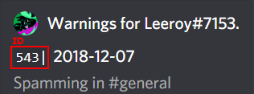

# Moderation Tools

## Management



#### Player Management

1. **?kick** 'user' 'reason'
2. **?ban** 'user' 'time' 'reason'
3. **+softban** 'user' 'reason' 
4. **?mute** 'user' 'time\(m\)' 'reason'
5. **?deafen** 'user'
6. **+warning**
   * **+warning add '**user' 'reason'
   * **+warning search** 'user'
   * **+warning void** 'id'  

     

#### Channel Management

1. **+remove**
   * **+remove all** 'limit'
   * **+remove user** 'user' 'limit'
   * **+remove contains** 'content'
   * **+remove embeds** 'limit'
   * **+remove reactions** 'limit' 
2. **?lock** '\#channel' 'time' 'reason'

#### Revoke Actions

1. **?unban** 'user' 'reason'
2. **?unmute** 'user'
3. **?undeafen** 'user'
4. **?unlock** '\#channel'



#### Player Management

1. **?kick** **-** Kick a user
2. **?ban** **-** Ban a user
3. **+softban** **-** Kicks a user and deletes all their recent messages 
4. **?mute** **-** Mute a member so they cannot type or speak, time limit in minutes
5. **?deafen** **-** Deafen a member
6. **+warning**
   * **+warning add** **-** Adds a new warning
   * **+warning search** **-** Shows a user's warnings
   * **+warning void** **-** Voids a warning

#### Channel Management

1. **+remove**
   * **+remove all** **-**  Deletes all messages in the limit regardless of what it says and who sent it
   * **+remove user -**   Deletes messages sent by the given members
   * **+remove contains -**  Deletes messages that contain a given keyword. _This must be at least 3 letters long_
   * **+remove embeds** **-**  Deletes messages that contain any embeds or attachments
   * **+remove reactions** **-**  Removes reactions posted to all messages within the range. 
2. **?lock** **-**  Lock a channel with optional timer and message 



