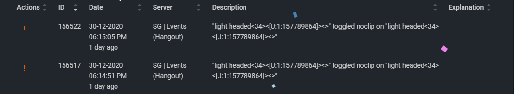

# Moderator portal

Moderators do not need to follow-up every single moderator command they use.

But if the Manager questions the moderator's behavior on how they use certain commands suspiciously. That Moderator needs to explain their action through discord or by using these follow-ups.

