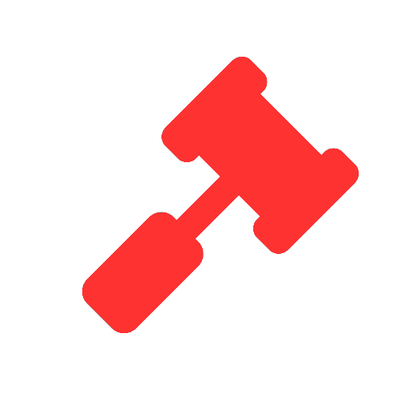

# Punishments v2


You **MUST** warn the player before performing a punishment action.


| Types of violations | Static Punishment |
| :--- | :--- |
| **Chat** |  |
| Spamming | 1h ban |
| Advertising |  |
|  |  |
| **Server** |  |
| Mic spamming + loud & earrape |  |
| Abusing !call |  |
| Trolling/ Griefing |  |
| Impersonate others |  |
| Stalling the game |  |
|  |  |
| **Global** |  |
| Alternative accounts | Permanent ban |
| Scamming | Permanent ban |
| NSFW content |  |
| Hacking / Cheating | Permanent ban |


Strikes are increased by **one** every time the player has done **anything** that violates the Rule of Conduct. \(Global record\)


|  | 🔨 | 🔨 | 🔨 | 🔨 | 🔨 | 🔨 | 🔨 | 🔨 | 🔨 | 🔨 [🚫](https://emojikeyboard.org/copy/Prohibited_Emoji_%F0%9F%9A%AB) |
| :--- | :--- | :--- | :--- | :--- | :--- | :--- | :--- | :--- | :--- | :--- |
| **Strikes** | 1st | 2nd | 3rd | 4th | 5th | 6th | 7th | 8th | 9th | 10th |
| **Additional Duration** | - | - | 1h | 3h | 6h | 12h | 1d | 3d | 7d | Perma |
| **Type** | - | - | Ban | Ban | Ban | Ban | Ban | Ban | Ban | Ban |

