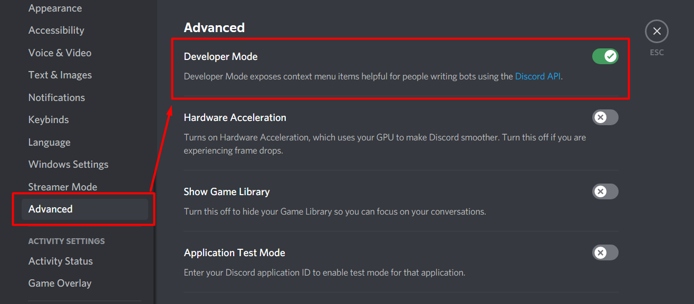

# Discord

## Moderation commands

<table>
  <thead>
    <tr>
      <th style="text-align:left">Commands</th>
      <th style="text-align:left">Explanation</th>
    </tr>
  </thead>
  <tbody>
    <tr>
      <td style="text-align:left"> <b>Player Management</b>
      </td>
      <td style="text-align:left"></td>
    </tr>
    <tr>
      <td style="text-align:left"><code>?kick</code> &lt;user&gt; &lt;reason&gt;</td>
      <td style="text-align:left"></td>
    </tr>
    <tr>
      <td style="text-align:left"><code>?ban</code> &lt;user&gt; &lt;time or 0&gt; &lt;reason&gt;</td>
      <td
      style="text-align:left">0 = Permanent</td>
    </tr>
    <tr>
      <td style="text-align:left"><code>?tempban</code> &lt;user&gt; &lt;time&gt; &lt;reason&gt;</td>
      <td
      style="text-align:left"></td>
    </tr>
    <tr>
      <td style="text-align:left"><code>?softban</code> &lt;user&gt; &lt;time&gt; &lt;reason&gt;</td>
      <td
      style="text-align:left"></td>
    </tr>
    <tr>
      <td style="text-align:left"></td>
      <td style="text-align:left"></td>
    </tr>
    <tr>
      <td style="text-align:left"> <code>?mute</code> &lt;user&gt; &lt;time&gt; &lt;reason&gt;</td>
      <td style="text-align:left"></td>
    </tr>
    <tr>
      <td style="text-align:left"> <code>?hardmute</code> &lt;user&gt; &lt;time&gt; &lt;reason&gt;</td>
      <td
      style="text-align:left"></td>
    </tr>
    <tr>
      <td style="text-align:left"></td>
      <td style="text-align:left"></td>
    </tr>
    <tr>
      <td style="text-align:left"> <code>pls roleban</code> &lt;user&gt;</td>
      <td style="text-align:left"><em>Takes away all of a user&#x2019;s roles and adds a &#x201C;rolebanned&#x201D; role. The player with this role will only see #jail</em>
      </td>
    </tr>
    <tr>
      <td style="text-align:left"></td>
      <td style="text-align:left"></td>
    </tr>
    <tr>
      <td style="text-align:left"> <code>?warn</code> &lt;user&gt; &lt;reason&gt;</td>
      <td style="text-align:left"> <em>Warns a player</em>
      </td>
    </tr>
    <tr>
      <td style="text-align:left"> <code>?warns</code> &lt;user&gt;</td>
      <td style="text-align:left"> <em>Shows a list of warns the player has</em>
      </td>
    </tr>
    <tr>
      <td style="text-align:left">&#x2014;&#x2014;&#x2014;&#x2014;&#x2014;&#x2014;&#x2014;&#x2014;&#x2014;&#x2014;&#x2014;&#x2014;&#x2014;&#x2014;&#x2014;&#x2014;&#x2014;&#x2014;&#x2014;&#x2014;&#x2014;&#x2014;</td>
      <td
      style="text-align:left"></td>
    </tr>
    <tr>
      <td style="text-align:left"><b>Channel Management</b>
      </td>
      <td style="text-align:left"></td>
    </tr>
    <tr>
      <td style="text-align:left">
        
<code>?purge </code>
        

        <ol>
          <li>user &lt;user&gt; &lt;limit&gt;</li>
          <li>contains</li>
          <li>embeds</li>
          <li>links</li>
          <li>emoji</li>
          <li>images</li>
        </ol>
      </td>
      <td style="text-align:left">
        
Deletes messages

        
<code>eg: ?purge user @Leeroy#7153 10 </code>
        

        
to delete Leeroy messages in 10 lines

      </td>
    </tr>
    <tr>
      <td style="text-align:left"></td>
      <td style="text-align:left"></td>
    </tr>
    <tr>
      <td style="text-align:left"><code>pls snipe</code>
      </td>
      <td style="text-align:left">
        
<em>Recovers the most recently deleted (or edited) </em>
        

        
<em>message in a channel</em>
        

      </td>
    </tr>
    <tr>
      <td style="text-align:left"> <code>pls slowmode</code> &lt;seconds&gt;</td>
      <td style="text-align:left"> <em>Apply slowmode on a channel</em>
      </td>
    </tr>
    <tr>
      <td style="text-align:left"><code>pls lockout </code>&lt;user&gt;</td>
      <td style="text-align:left"> <em>Prevents the user from being able to type in the channel</em>
      </td>
    </tr>
    <tr>
      <td style="text-align:left"></td>
      <td style="text-align:left"></td>
    </tr>
    <tr>
      <td style="text-align:left"><code>pls lockdown</code>
      </td>
      <td style="text-align:left"> <em>Close off a channel</em>
      </td>
    </tr>
    <tr>
      <td style="text-align:left"><code>?lockdown server</code>
      </td>
      <td style="text-align:left"><em>Close off every channel</em>
      </td>
    </tr>
    <tr>
      <td style="text-align:left">&#x2014;&#x2014;&#x2014;&#x2014;&#x2014;&#x2014;&#x2014;&#x2014;&#x2014;&#x2014;&#x2014;&#x2014;&#x2014;&#x2014;&#x2014;&#x2014;&#x2014;&#x2014;&#x2014;&#x2014;&#x2014;&#x2014;</td>
      <td
      style="text-align:left"></td>
    </tr>
    <tr>
      <td style="text-align:left"> <b>Role Management</b>
      </td>
      <td style="text-align:left"></td>
    </tr>
    <tr>
      <td style="text-align:left"> <code>?role</code> &lt;member&gt; &lt;role&gt;</td>
      <td style="text-align:left"> <em>Adds/removes a role from the specified member</em>
      </td>
    </tr>
    <tr>
      <td style="text-align:left"> <code>?temprole</code> &lt;member&gt; &lt;time&gt; &lt;role&gt;</td>
      <td
      style="text-align:left">
        
<em>Adds a role for some time </em>
        

        
<em>removes it after the time is up</em>
        

        </td>
    </tr>
    <tr>
      <td style="text-align:left"> <code>pls pingable</code> &lt;role&gt;</td>
      <td style="text-align:left"> <em>Makes a role pingable only once</em>
      </td>
    </tr>
    <tr>
      <td style="text-align:left">&#x2014;&#x2014;&#x2014;&#x2014;&#x2014;&#x2014;&#x2014;&#x2014;&#x2014;&#x2014;&#x2014;&#x2014;&#x2014;&#x2014;&#x2014;&#x2014;&#x2014;&#x2014;&#x2014;&#x2014;&#x2014;&#x2014;</td>
      <td
      style="text-align:left"></td>
    </tr>
    <tr>
      <td style="text-align:left"> <b>Revoke Actions</b>
      </td>
      <td style="text-align:left"></td>
    </tr>
    <tr>
      <td style="text-align:left"> <code>?unban</code> &lt;user&gt; &lt;reason&gt;</td>
      <td style="text-align:left"></td>
    </tr>
    <tr>
      <td style="text-align:left"> <code>?unmute</code> &lt;user&gt;</td>
      <td style="text-align:left"></td>
    </tr>
    <tr>
      <td style="text-align:left"> <code>pls urb</code> &lt;user&gt;</td>
      <td style="text-align:left">
        
<em>Reverts the effects of pls roleban by </em>
        

        
<em>removing the rolebanned role</em><code> </code>
        

        
<em>and returning the roles before being rolebanned</em>
        

      </td>
    </tr>
  </tbody>
</table>

